# Section 8: System Implementation & Module Specifications

## 8.1 Authentication and Profile Module
This module manages registration, login, logout, sessions, role identification, and profile updates. Registration is restricted to student accounts at the public entry point. During login, the system validates credentials and establishes the session required for protected pages. The security design includes password hashing, password verification, session identifier regeneration, CSRF validation, and output escaping.

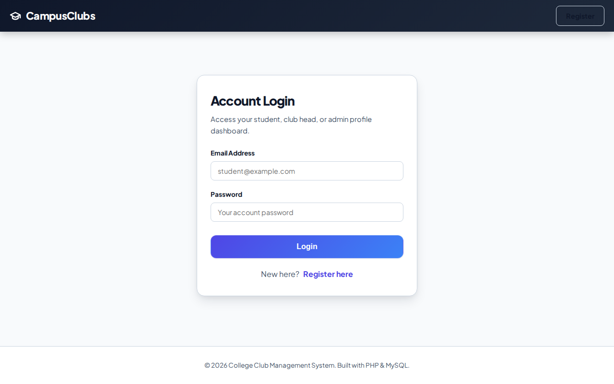
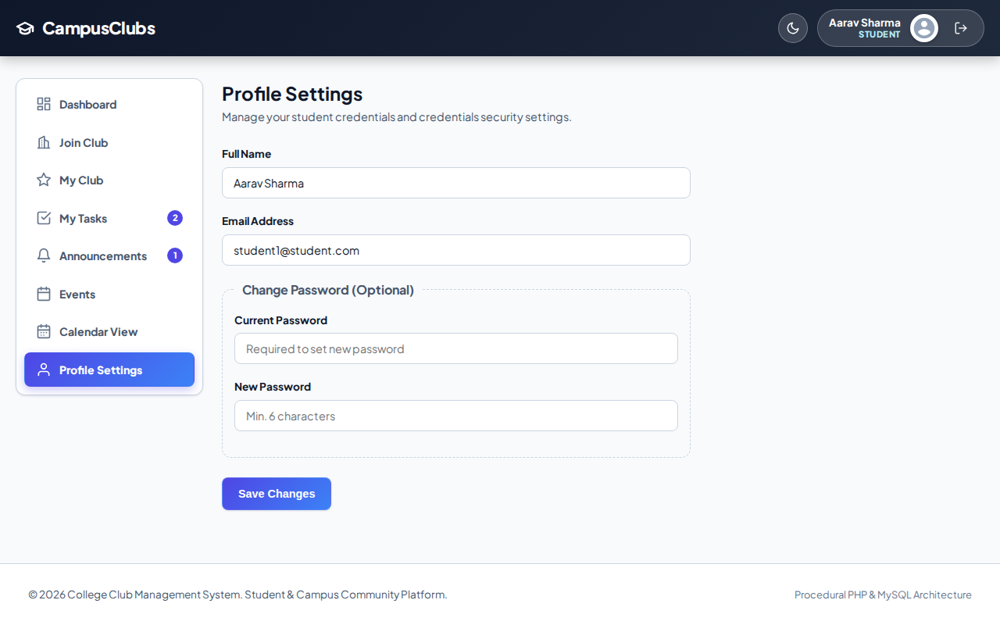

## 8.2 Administrator Module
The Administrator module provides global system control. The administrator can create and manage clubs, assign Club Heads, configure system settings such as the maximum number of active clubs per student, define global responsibilities, monitor memberships, events, tasks, attendance, feedback, and publish system-wide announcements. Club logos and club email templates are also managed from the administrative workflow.

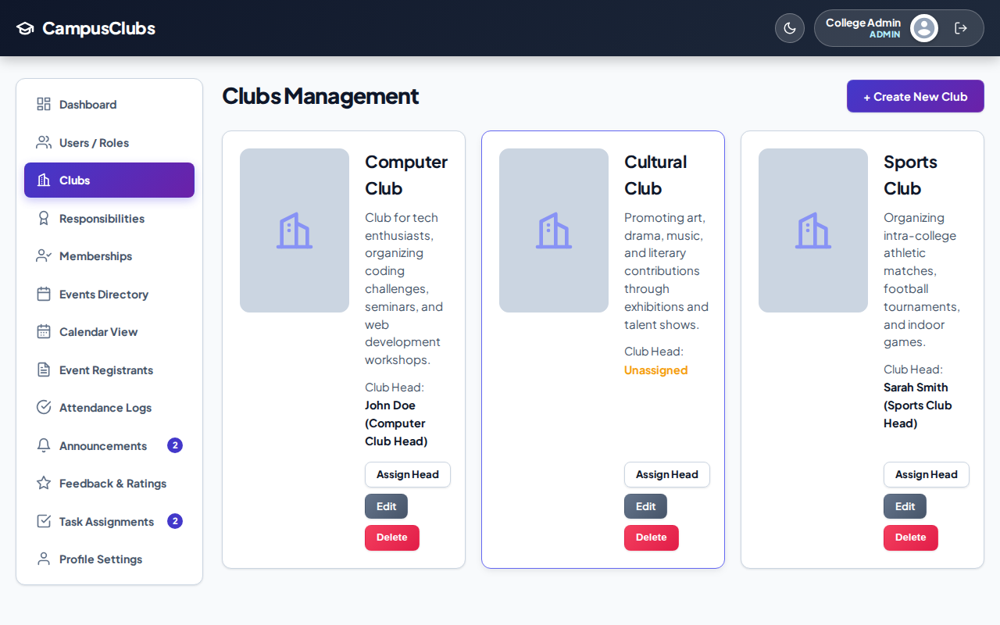

## 8.3 Club and Membership Management Module
This module manages club discovery, join requests, approval or rejection, active membership status, and leave requests. Before a membership request is inserted, the system checks the configured club limit. Once approved, the membership record becomes active and can contain an optional responsibility assignment. The system design also supports automated membership approval email notifications.

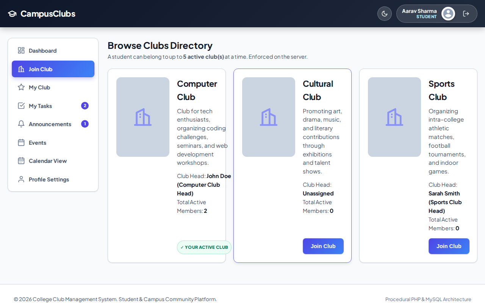
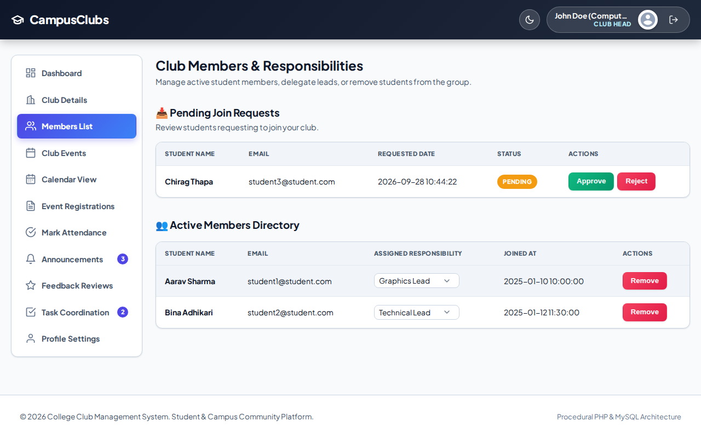

## 8.5 Event Management Module
The Event Management module allows Club Heads and Administrators to create and update events. An event stores its club, title, description, scheduled date and time, location, and status. The application supports upcoming, completed, and cancelled event states. Students and active members can register for events, while a unique event-user combination prevents duplicate registrations.

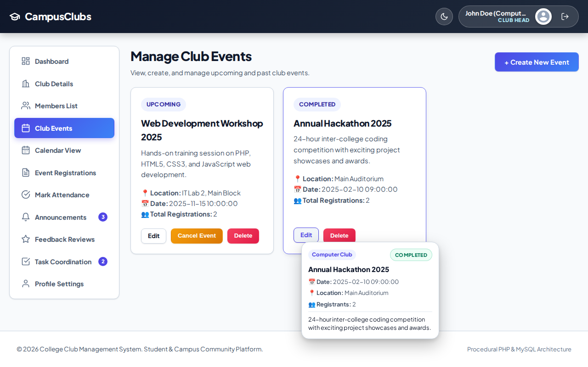
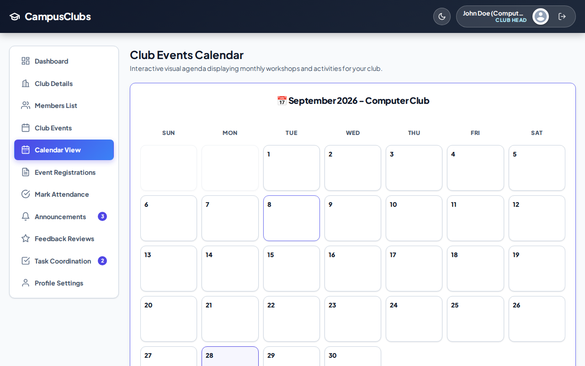

## 8.6 Event Registration and Attendance Module
Event registration records connect users to events. After an event is completed, authorized Club Heads or Administrators can record attendance as present or absent. The database uses a unique event-user constraint for attendance records, allowing an attendance record to represent one user's participation in one event.

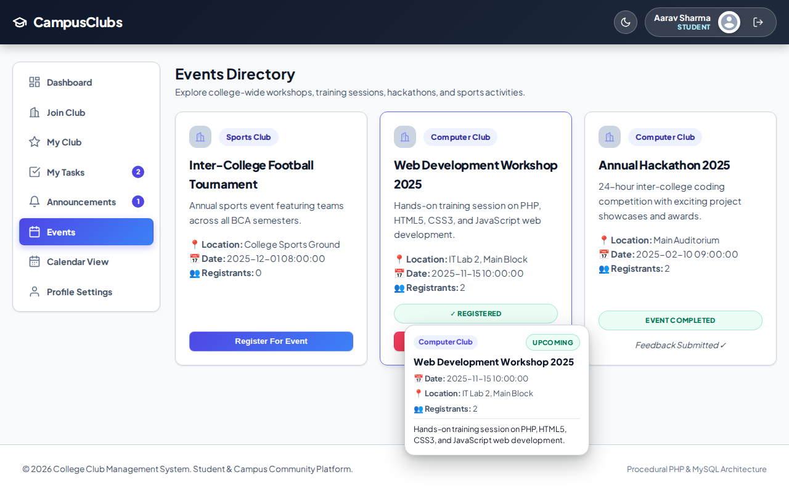
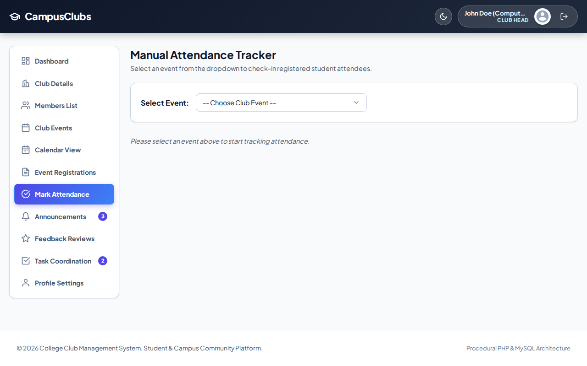

## 8.7 Task and Responsibility Management Module
The Task Management module allows Club Heads and Administrators to create tasks and assign them to active members or responsibilities. Tasks contain a title, description, priority, status, deadline, associated club, optional event, assignee, and assignor. Active members can update their task status from pending to in_progress and completed, and can post comments as progress updates. Overdue status is derived from deadline and completion state.

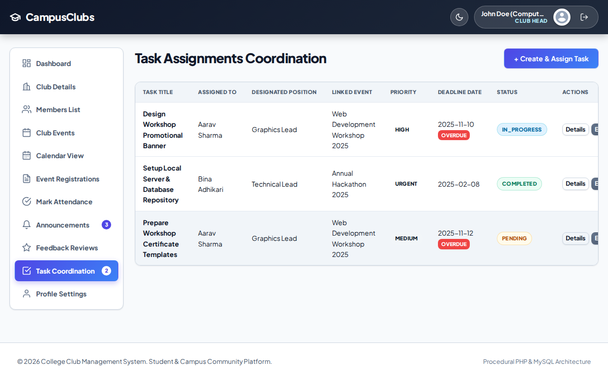
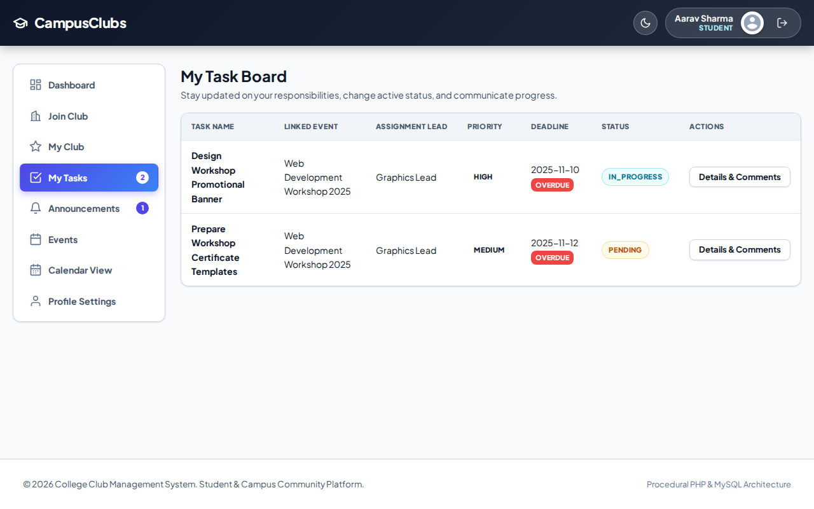

## 8.8 Announcement Management Module
Announcements provide structured communication for the college and individual clubs. The system supports GLOBAL, CLUB, and PRIVATE scopes. Private announcements are restricted to active club members. Announcement read state is stored separately using announcement_reads so that unread counters can be calculated for the user interface.

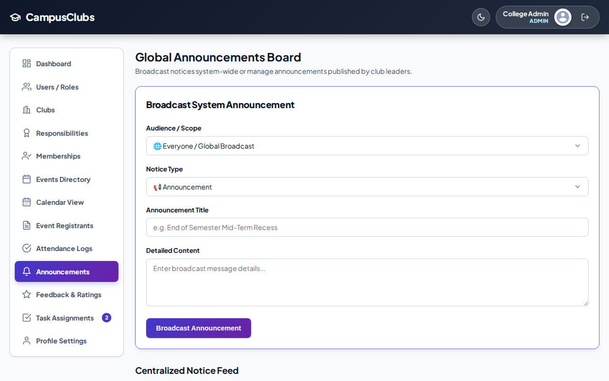
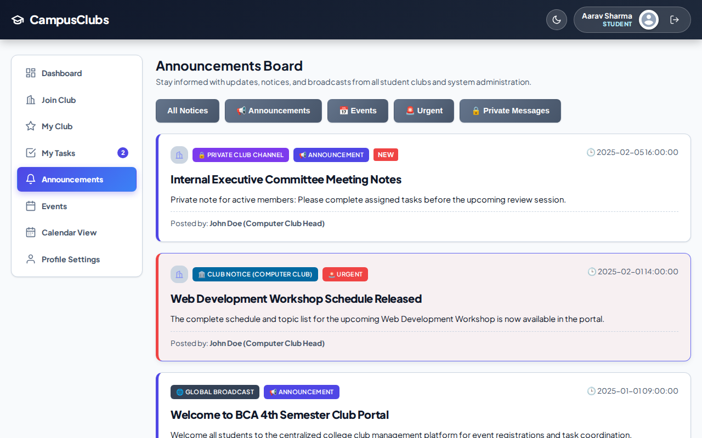

## 8.9 Feedback Module
The Feedback module collects post-event ratings and comments. Registered event attendees and eligible club members can submit a rating from 1 to 5 together with optional qualitative feedback. A unique event-user constraint prevents multiple feedback records for the same user and event.

## 8.10 AJAX Realtime Polling Module
The system includes lightweight AJAX endpoints for counts, announcements, requests, and tasks. These endpoints return JSON data that can update sidebar badges and dynamic counters without requiring a complete page refresh. The system specification identifies ajax/counts.php, ajax/announcements.php, ajax/requests.php, and ajax/tasks.php for this purpose.

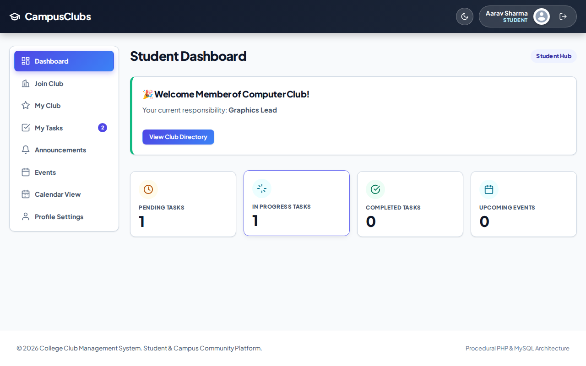

## 8.11 Database Implementation
The database implementation follows the relational model documented for the project. The design uses primary keys for entity identity, foreign keys for relationships, unique constraints to prevent duplicate event registration/attendance/feedback, composite keys for announcement reads, and controlled ON DELETE behaviors. The database dictionary documents 13 entities and their attributes.

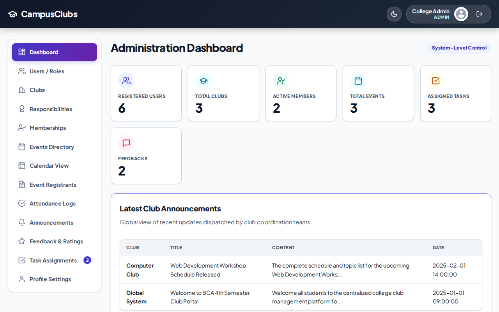
