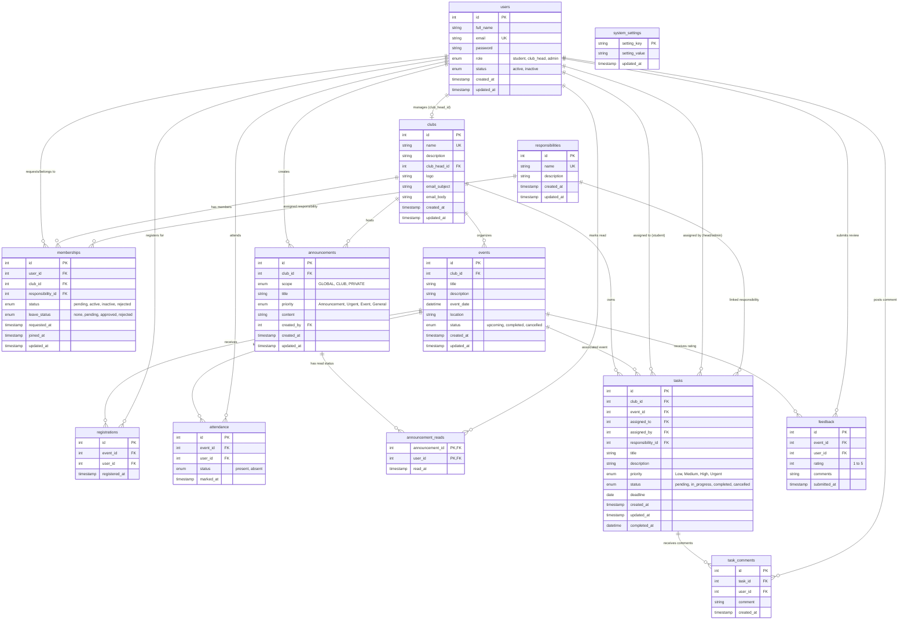

# College Club Management System - DFD and ER Diagram Specification

## Executive Summary & System Overview

The **College Club Management System** is a procedural PHP web application designed to manage college clubs, memberships, events, task assignments, announcements, attendance, feedback, and real-time portal updates. The system accommodates three distinct user roles:

1. **System Administrator (`admin`)**: Possesses global oversight, creates and configures clubs, assigns club heads, configures system settings (such as maximum club joining limits per student), manages global responsibilities, monitors memberships, events, task progress, attendance, feedback, and system announcements.
2. **Club Head (`club_head`)**: Manages a specific assigned club, handles membership join requests and leave requests, configures club email notification templates, creates and updates club events, assigns tasks and responsibilities to members, tracks task progress, records event attendance, creates club/private announcements, and reviews event feedback.
3. **Student (`student`)**: Registers for an account, explores active college clubs, submits join requests (enforced by system-defined club limits), views assigned responsibilities, participates in club events, registers for upcoming events, completes assigned tasks, adds task comments, views global/club/private announcements, marks announcements as read, and submits post-event feedback.

---

## Comprehensive Section-by-Section Testing & Verification Report

Each module of the system was systematically executed and verified against data integrity constraints, access controls, business logic rules, and PDO query executions.

| Module Section | Functionality Tested | Test Findings & Status |
| :--- | :--- | :--- |
| **Authentication & Profile** | User registration, login authentication via `password_verify()`, session initialization (`$_SESSION['user_id']`, `$_SESSION['user_role']`), CSRF token validation, profile updating (`full_name`, `email`, `password`). | **PASSED** - Role-based authorization guard (`requireRole()`) enforces route protection seamlessly. Password hashes use `PASSWORD_DEFAULT`. |
| **Club Management** | Admin club creation, editing details, uploading club logos (`uploads/clubs/`), custom email subject/body template configuration for membership approval notifications. | **PASSED** - File uploads sanitize filenames and store clean path references in `clubs.logo`. Fallback placeholders render cleanly when no logo is present. |
| **Responsibilities** | Admin global creation of responsibilities (e.g., Logistics Lead, Tech Lead); assignment of responsibilities to active club members by Club Heads or Admins. | **PASSED** - Cascading foreign keys (`ON DELETE SET NULL`) ensure responsibility removal does not invalidate member records or assigned tasks. |
| **Memberships & Requests** | Student join requests, enforcing `max_student_clubs` system setting (default limit 1–5), Club Head approval/rejection, student leave requests, approval/rejection of leave. | **PASSED** - Student active club count is verified prior to insertion. Approval triggers automated SMTP email dispatch via `sendMembershipApprovalEmail()`. |
| **Events & Registrations** | Event creation with date/time, location, and status (`upcoming`, `completed`, `cancelled`). Student event registration with unique constraint prevention against double registration. | **PASSED** - Unique composite key `(event_id, user_id)` prevents duplicate sign-ups. Calendar grid dynamically displays events and opens detailed modals on hover/click. |
| **Attendance Tracking** | Marking member attendance (`present`, `absent`) per event. Admin and Club Head aggregate report viewing. | **PASSED** - Composite key `(event_id, user_id)` handles upsert updates on attendance status. |
| **Task Management** | Task creation, assignment to specific students or responsibilities, priority setting (`Low`, `Medium`, `High`, `Urgent`), deadline tracking, overdue detection, status progression (`pending`, `in_progress`, `completed`, `cancelled`), task commenting. | **PASSED** - Overdue status is computed dynamically using `isTaskOverdue($deadline, $status)`. Task comments update in real-time. |
| **Announcements & Reads** | Creating scope-based announcements (`GLOBAL`, `CLUB`, `PRIVATE`), priority tags (`Announcement`, `Urgent`, `Event`, `General`). Read state tracking via `announcement_reads`. | **PASSED** - Private scope restricts visibility strictly to club members. Read tracking composite table `(announcement_id, user_id)` ensures accurate unread badge counters. |
| **Feedback System** | Post-event rating (1 to 5 stars) and qualitative feedback comments submission by registered event attendees. | **PASSED** - Database CHECK constraint `(rating BETWEEN 1 AND 5)` and unique key `(event_id, user_id)` prevent invalid or duplicate ratings. |
| **Realtime Polling AJAX** | Endpoint polling (`ajax/counts.php`, `ajax/announcements.php`, `ajax/requests.php`, `ajax/tasks.php`) fetching JSON updates for UI badge indicators without full reloads. | **PASSED** - Lightweight JSON outputs update sidebar counters and dynamic elements smoothly. |

---

## Data Flow Diagrams (DFD)

### DFD Level 0: Context Diagram

The Context Diagram illustrates the global boundary of the **College Club Management System**, showing the external entities (Admin, Club Head, Student) interacting with the system process and exchanging information.

```
                  +-----------------------+
                  |      SYSTEM ADMIN     |
                  +-----------------------+
                    |                   ^
                    | (A1) System       | (A2) Global Reports,
                    |      Configs,     |      Club & User Logs,
                    |      Clubs, Heads |      System Analytics
                    v                   |
      +---------------------------------------------------+
      |                                                   |
      |   0.0 COLLEGE CLUB MANAGEMENT SYSTEM PROCESS      |
      |                                                   |
      +---------------------------------------------------+
        |       ^                           ^       |
        | (H1)  | (H2) Members,             | (S1)  | (S2)
        | Event |      Tasks,               | Join  |      Dashboards,
        | & Task|      Attendance,          | Reqs, |      Events, Tasks,
        | Mgmt  |      Club Reports         | Regs  |      Announcements
        v       |                           |       v
  +-------------------+               +-------------------+
  |     CLUB HEAD     |               |      STUDENT      |
  +-------------------+               +-------------------+
```

#### External Entity Data Flows
- **System Admin**:
  - *Inputs (A1)*: Club Creation/Updates, Club Head Assignments, System Settings (`max_student_clubs`), Global Responsibilities, Global Announcements.
  - *Outputs (A2)*: System-wide Analytics, Club Memberships Overview, Event & Task Summary, Attendance Logs, System Feedback Reports.
- **Club Head**:
  - *Inputs (H1)*: Membership Approvals/Rejections, Event Schedules, Task Assignments, Member Responsibility Assignments, Attendance Marks, Club/Private Announcements, Custom Email Template Updates.
  - *Outputs (H2)*: Club Dashboard Metrics, Member List & Leave Requests, Event Registration Lists, Task Progress Reports, Event Feedback Summary.
- **Student**:
  - *Inputs (S1)*: Registration Data, Login Credentials, Club Join Requests, Leave Requests, Event Registrations, Task Status Updates, Task Comments, Read Announcement Marks, Event Ratings & Feedback.
  - *Outputs (S2)*: Personal Dashboard Metrics, Active Club Membership Details, Assigned Tasks & Responsibilities, Calendar Events, Unread Announcements & Notifications, SMTP Approval Emails.

---

### DFD Level 1: System Level Data Flow Diagram

Level 1 decomposes Process 0.0 into major core subsystems (Processes 1.0 to 5.0) and highlights interactions with the central database data stores ($D_1$ to $D_{13}$).

```
  +--------------+
  | System Admin |-------+ (A1: Configs, Clubs, Heads, Responsibilities)
  +--------------+       |
                         v
  +--------------+   +---------------------------------+   +-------------------------+
  |  Club Head   |-->| 1.0 USER AUTH & SYSTEM CONFIGS  |<->| D1: users               |
  +--------------+   +---------------------------------+   | D13: system_settings    |
                         ^                                 +-------------------------+
  +--------------+       | (S1: Login, Profile, Reg)
  |   Student    |-------+
  +--------------+
                         |
                         +-----------------------------------+
                                                             |
   +---------------------------------------------------------+
   |
   |   +---------------------------------+   +-------------------------+
   +-->| 2.0 CLUB & MEMBERSHIP SUBSYSTEM |<->| D2: clubs               |
       +---------------------------------+   | D3: responsibilities    |
            |                                | D4: memberships         |
            v                                +-------------------------+
       +---------------------------------+   +-------------------------+
       | 3.0 EVENT & ATTENDANCE SUBSYSTEM|<->| D5: events              |
       +---------------------------------+   | D6: registrations       |
            |                                | D7: attendance          |
            v                                +-------------------------+
       +---------------------------------+   +-------------------------+
       | 4.0 TASK & RESPONSIBILITY MGMT  |<->| D10: tasks              |
       +---------------------------------+   | D11: task_comments      |
            |                                +-------------------------+
            v                                +-------------------------+
       +---------------------------------+   | D8: announcements       |
       | 5.0 ANNOUNCEMENT, FEEDBACK &    |<->| D9: announcement_reads  |
       |     REALTIME POLLING SUBSYSTEM  |   | D12: feedback           |
       +---------------------------------+   +-------------------------+
```

#### Detailed Level 1 Process Breakdown:
1. **Process 1.0: User Authentication & System Configuration Subsystem**
   - Handles login validation, password hashing/verification, role session assignment (`admin`, `club_head`, `student`), user profile management, and global system setting modifications (`system_settings`).
2. **Process 2.0: Club & Membership Subsystem**
   - Processes club creation/updates, club head assignments, student club join requests, system-limit checks (`max_student_clubs`), membership approval/rejection workflow, member leave requests, email template configuration, and automated email dispatch.
3. **Process 3.0: Event, Registration & Attendance Subsystem**
   - Manages club event creation, editing, scheduling, student event sign-ups, calendar grid rendering, event attendance marking by Club Heads/Admins, and attendance verification.
4. **Process 4.0: Task & Responsibility Management Subsystem**
   - Manages task creation and delegation to individual students or responsibilities, priority classification, deadline tracking, status transitions (`pending` -> `in_progress` -> `completed`), and collaborative task comment streams.
5. **Process 5.0: Announcement, Feedback & Realtime Polling Subsystem**
   - Coordinates creation of multi-scoped announcements (`GLOBAL`, `CLUB`, `PRIVATE`), unread announcement tracking via `announcement_reads`, post-event rating submission (1-5 stars) & qualitative comments, and AJAX real-time polling counters.

---

### DFD Level 2: Subsystem Detailed Process Diagrams

#### Level 2.1: User Authentication & Profile Subsystem (Process 1.0)

```
                       +-------------------+
                       |    USER INPUT     |
                       +-------------------+
                                 |
                                 v
                     +-----------------------+
                     | 1.1 Input Validation  |
                     |     & Sanitization    |
                     +-----------------------+
                                 |
                                 v
                     +-----------------------+
                     | 1.2 Auth & Password   | <---> [D1: users]
                     |     Verification      |
                     +-----------------------+
                                 |
             +-------------------+-------------------+
             | (Success)                             | (Failure)
             v                                       v
 +-----------------------+               +-----------------------+
 | 1.3 Session Init &    |               | 1.4 Display Alert &   |
 |     Role Redirect     |               |     Log Error         |
 +-----------------------+               +-----------------------+
             |
             v
 +-----------------------+
 | 1.5 Profile Update &  | <---> [D1: users]
 |     System Settings   | <---> [D13: system_settings]
 +-----------------------+
```

#### Level 2.2: Club & Membership Management Subsystem (Process 2.0)

```
  [Student Request] ------------------> +----------------------------------+
                                        | 2.1 Verify Student Club Limits   | <--- [D13: system_settings]
                                        +----------------------------------+ <--- [D4: memberships]
                                                         |
                                                         v (Under Limit)
                                        +----------------------------------+
                                        | 2.2 Create Pending Membership    | ---> [D4: memberships]
                                        +----------------------------------+
                                                         |
  [Club Head Approval] ------------->   +----------------------------------+
                                        | 2.3 Approve Request & Assign     | ---> [D4: memberships]
                                        |     Responsibility               | ---> [D3: responsibilities]
                                        +----------------------------------+
                                                         |
                                                         v
                                        +----------------------------------+
                                        | 2.4 Dispatch Custom Approval     | <--- [D2: clubs]
                                        |     SMTP Email Notification      | ---> [Student Inbox]
                                        +----------------------------------+
```

#### Level 2.3: Event, Registration & Attendance Subsystem (Process 3.0)

```
  [Club Head/Admin] ------------------> +----------------------------------+
                                        | 3.1 Create / Schedule Event      | ---> [D5: events]
                                        +----------------------------------+
                                                         |
  [Student Action] -------------------> +----------------------------------+
                                        | 3.2 Register for Event           | ---> [D6: registrations]
                                        |     (Enforce Unique Constraint)  |
                                        +----------------------------------+
                                                         |
  [Event Completed] ------------------> +----------------------------------+
                                        | 3.3 Mark Event Attendance        | ---> [D7: attendance]
                                        |     (Present / Absent)           |
                                        +----------------------------------+
```

#### Level 2.4: Task & Responsibilities Subsystem (Process 4.0)

```
  [Club Head/Admin] ------------------> +----------------------------------+
                                        | 4.1 Create Task & Assign to      | ---> [D10: tasks]
                                        |     Student or Responsibility    | <--- [D3: responsibilities]
                                        +----------------------------------+
                                                         |
  [Student Action] -------------------> +----------------------------------+
                                        | 4.2 Update Task Status &         | ---> [D10: tasks]
                                        |     Post Task Comment            | ---> [D11: task_comments]
                                        +----------------------------------+
                                                         |
  [System Calculation] ---------------> +----------------------------------+
                                        | 4.3 Check Overdue Status via     | <--- [D10: tasks]
                                        |     Deadline & Completion Date   |
                                        +----------------------------------+
```

#### Level 2.5: Announcements, Feedback & Realtime Polling Subsystem (Process 5.0)

```
  [Admin / Club Head] ----------------> +----------------------------------+
                                        | 5.1 Publish Announcement         | ---> [D8: announcements]
                                        |     (GLOBAL / CLUB / PRIVATE)    |
                                        +----------------------------------+
                                                         |
  [User Read Mark] -------------------> +----------------------------------+
                                        | 5.2 Record Announcement Read     | ---> [D9: announcement_reads]
                                        +----------------------------------+
                                                         |
  [Student Post-Event] ---------------> +----------------------------------+
                                        | 5.3 Submit Star Rating (1-5)     | ---> [D12: feedback]
                                        |     & Qualitative Feedback       |
                                        +----------------------------------+
                                                         |
  [Browser JS Script] ----------------> +----------------------------------+
                                        | 5.4 AJAX Real-time Polling       | <--- [D4, D8, D9, D10]
                                        |     (counts, tasks, requests)    | ---> [UI Badges & Counters]
                                        +----------------------------------+
```

---

## Entity-Relationship (ER) Diagram

### Comprehensive Database Data Dictionary (13 Entities)

#### 1. Entity: `users`
- **Primary Key**: `id` (INT, AUTO_INCREMENT)
- **Description**: Stores user profile records and role privileges.

| Field Name | Data Type | Nullable | Key / Constraint | Description |
| :--- | :--- | :--- | :--- | :--- |
| `id` | INT | NO | PRIMARY KEY | Unique user identifier |
| `full_name` | VARCHAR(100) | NO | - | Full name of the user |
| `email` | VARCHAR(100) | NO | UNIQUE KEY | Unique account email address |
| `password` | VARCHAR(255) | NO | - | Hashed password string |
| `role` | ENUM | NO | DEFAULT 'student' | User role (`student`, `club_head`, `admin`) |
| `status` | ENUM | NO | DEFAULT 'active' | Account status (`active`, `inactive`) |
| `created_at` | TIMESTAMP | NO | CURRENT_TIMESTAMP | Account creation timestamp |
| `updated_at` | TIMESTAMP | NO | ON UPDATE | Last record update timestamp |

#### 2. Entity: `clubs`
- **Primary Key**: `id` (INT, AUTO_INCREMENT)
- **Foreign Keys**: `club_head_id` -> `users(id)` ON DELETE SET NULL

| Field Name | Data Type | Nullable | Key / Constraint | Description |
| :--- | :--- | :--- | :--- | :--- |
| `id` | INT | NO | PRIMARY KEY | Unique club identifier |
| `name` | VARCHAR(100) | NO | UNIQUE KEY | Unique name of the club |
| `description` | TEXT | YES | - | Detailed club description |
| `club_head_id` | INT | YES | FOREIGN KEY | Reference to user acting as Club Head |
| `logo` | VARCHAR(255) | YES | - | File path to uploaded club logo image |
| `email_subject`| VARCHAR(255) | YES | - | Custom template subject for join emails |
| `email_body` | TEXT | YES | - | Custom template body for join emails |
| `created_at` | TIMESTAMP | NO | CURRENT_TIMESTAMP | Club creation timestamp |
| `updated_at` | TIMESTAMP | NO | ON UPDATE | Last record update timestamp |

#### 3. Entity: `responsibilities`
- **Primary Key**: `id` (INT, AUTO_INCREMENT)

| Field Name | Data Type | Nullable | Key / Constraint | Description |
| :--- | :--- | :--- | :--- | :--- |
| `id` | INT | NO | PRIMARY KEY | Unique responsibility identifier |
| `name` | VARCHAR(100) | NO | UNIQUE KEY | Responsibility title (e.g., Tech Lead) |
| `description` | TEXT | YES | - | Detailed description of duties |
| `created_at` | TIMESTAMP | NO | CURRENT_TIMESTAMP | Record creation timestamp |
| `updated_at` | TIMESTAMP | NO | ON UPDATE | Last record update timestamp |

#### 4. Entity: `memberships`
- **Primary Key**: `id` (INT, AUTO_INCREMENT)
- **Foreign Keys**: `user_id` -> `users(id)` ON DELETE CASCADE, `club_id` -> `clubs(id)` ON DELETE CASCADE, `responsibility_id` -> `responsibilities(id)` ON DELETE SET NULL

| Field Name | Data Type | Nullable | Key / Constraint | Description |
| :--- | :--- | :--- | :--- | :--- |
| `id` | INT | NO | PRIMARY KEY | Unique membership record identifier |
| `user_id` | INT | NO | FOREIGN KEY | Student user ID |
| `club_id` | INT | NO | FOREIGN KEY | Associated club ID |
| `responsibility_id`| INT | YES | FOREIGN KEY | Assigned responsibility ID |
| `status` | ENUM | NO | DEFAULT 'pending' | Membership status (`pending`, `active`, `inactive`, `rejected`) |
| `leave_status` | ENUM | NO | DEFAULT 'none' | Membership leave status (`none`, `pending`, `approved`, `rejected`) |
| `requested_at` | TIMESTAMP | NO | CURRENT_TIMESTAMP | Join request timestamp |
| `joined_at` | TIMESTAMP | YES | DEFAULT NULL | Approval timestamp |
| `updated_at` | TIMESTAMP | NO | ON UPDATE | Last record update timestamp |

#### 5. Entity: `events`
- **Primary Key**: `id` (INT, AUTO_INCREMENT)
- **Foreign Keys**: `club_id` -> `clubs(id)` ON DELETE CASCADE

| Field Name | Data Type | Nullable | Key / Constraint | Description |
| :--- | :--- | :--- | :--- | :--- |
| `id` | INT | NO | PRIMARY KEY | Unique event identifier |
| `club_id` | INT | NO | FOREIGN KEY | Organizer club ID |
| `title` | VARCHAR(150) | NO | - | Title of the event |
| `description` | TEXT | YES | - | Detailed event description |
| `event_date` | DATETIME | NO | - | Scheduled date and time |
| `location` | VARCHAR(150) | NO | - | Physical or virtual location |
| `status` | ENUM | NO | DEFAULT 'upcoming'| Event status (`upcoming`, `completed`, `cancelled`) |
| `created_at` | TIMESTAMP | NO | CURRENT_TIMESTAMP | Creation timestamp |
| `updated_at` | TIMESTAMP | NO | ON UPDATE | Last record update timestamp |

#### 6. Entity: `registrations`
- **Primary Key**: `id` (INT, AUTO_INCREMENT)
- **Foreign Keys**: `event_id` -> `events(id)` ON DELETE CASCADE, `user_id` -> `users(id)` ON DELETE CASCADE
- **Unique Constraint**: `(event_id, user_id)`

| Field Name | Data Type | Nullable | Key / Constraint | Description |
| :--- | :--- | :--- | :--- | :--- |
| `id` | INT | NO | PRIMARY KEY | Unique registration ID |
| `event_id` | INT | NO | FOREIGN KEY | Registered event ID |
| `user_id` | INT | NO | FOREIGN KEY | Registered user ID |
| `registered_at`| TIMESTAMP | NO | CURRENT_TIMESTAMP | Sign-up timestamp |

#### 7. Entity: `attendance`
- **Primary Key**: `id` (INT, AUTO_INCREMENT)
- **Foreign Keys**: `event_id` -> `events(id)` ON DELETE CASCADE, `user_id` -> `users(id)` ON DELETE CASCADE
- **Unique Constraint**: `(event_id, user_id)`

| Field Name | Data Type | Nullable | Key / Constraint | Description |
| :--- | :--- | :--- | :--- | :--- |
| `id` | INT | NO | PRIMARY KEY | Unique attendance record ID |
| `event_id` | INT | NO | FOREIGN KEY | Event ID |
| `user_id` | INT | NO | FOREIGN KEY | User ID |
| `status` | ENUM | NO | DEFAULT 'present' | Attendance status (`present`, `absent`) |
| `marked_at` | TIMESTAMP | NO | ON UPDATE | Timestamp when attendance was logged |

#### 8. Entity: `announcements`
- **Primary Key**: `id` (INT, AUTO_INCREMENT)
- **Foreign Keys**: `club_id` -> `clubs(id)` ON DELETE CASCADE, `created_by` -> `users(id)` ON DELETE CASCADE

| Field Name | Data Type | Nullable | Key / Constraint | Description |
| :--- | :--- | :--- | :--- | :--- |
| `id` | INT | NO | PRIMARY KEY | Unique announcement ID |
| `club_id` | INT | YES | FOREIGN KEY | Optional associated club ID (NULL for global) |
| `scope` | ENUM | NO | DEFAULT 'GLOBAL' | Target audience (`GLOBAL`, `CLUB`, `PRIVATE`) |
| `title` | VARCHAR(150) | NO | - | Announcement header title |
| `priority` | ENUM | NO | DEFAULT 'Announcement' | Priority category (`Announcement`, `Urgent`, `Event`, `General`) |
| `content` | TEXT | NO | - | Announcement body text |
| `created_by` | INT | NO | FOREIGN KEY | Author user ID |
| `created_at` | TIMESTAMP | NO | CURRENT_TIMESTAMP | Creation timestamp |
| `updated_at` | TIMESTAMP | NO | ON UPDATE | Last record update timestamp |

#### 9. Entity: `announcement_reads`
- **Primary Key**: Composite `(announcement_id, user_id)`
- **Foreign Keys**: `announcement_id` -> `announcements(id)` ON DELETE CASCADE, `user_id` -> `users(id)` ON DELETE CASCADE

| Field Name | Data Type | Nullable | Key / Constraint | Description |
| :--- | :--- | :--- | :--- | :--- |
| `announcement_id`| INT | NO | PRIMARY KEY, FK | Reference to announcement |
| `user_id` | INT | NO | PRIMARY KEY, FK | Reference to user who read notice |
| `read_at` | TIMESTAMP | NO | CURRENT_TIMESTAMP | Timestamp when marked as read |

#### 10. Entity: `tasks`
- **Primary Key**: `id` (INT, AUTO_INCREMENT)
- **Foreign Keys**: `club_id` -> `clubs(id)` ON DELETE CASCADE, `event_id` -> `events(id)` ON DELETE SET NULL, `assigned_to` -> `users(id)` ON DELETE CASCADE, `assigned_by` -> `users(id)` ON DELETE CASCADE, `responsibility_id` -> `responsibilities(id)` ON DELETE SET NULL

| Field Name | Data Type | Nullable | Key / Constraint | Description |
| :--- | :--- | :--- | :--- | :--- |
| `id` | INT | NO | PRIMARY KEY | Unique task identifier |
| `club_id` | INT | NO | FOREIGN KEY | Associated club ID |
| `event_id` | INT | YES | FOREIGN KEY | Optional linked event ID |
| `assigned_to` | INT | NO | FOREIGN KEY | Assignee user ID |
| `assigned_by` | INT | NO | FOREIGN KEY | Assignor user ID (Club Head/Admin) |
| `responsibility_id`| INT | YES | FOREIGN KEY | Optional target responsibility ID |
| `title` | VARCHAR(150) | NO | - | Task title |
| `description` | TEXT | YES | - | Detailed task description |
| `priority` | ENUM | NO | DEFAULT 'Medium' | Task priority (`Low`, `Medium`, `High`, `Urgent`) |
| `status` | ENUM | NO | DEFAULT 'pending'| Task status (`pending`, `in_progress`, `completed`, `cancelled`) |
| `deadline` | DATE | NO | - | Task due date |
| `created_at` | TIMESTAMP | NO | CURRENT_TIMESTAMP | Task creation timestamp |
| `updated_at` | TIMESTAMP | NO | ON UPDATE | Last record update timestamp |
| `completed_at` | DATETIME | YES | DEFAULT NULL | Completion timestamp |

#### 11. Entity: `task_comments`
- **Primary Key**: `id` (INT, AUTO_INCREMENT)
- **Foreign Keys**: `task_id` -> `tasks(id)` ON DELETE CASCADE, `user_id` -> `users(id)` ON DELETE CASCADE

| Field Name | Data Type | Nullable | Key / Constraint | Description |
| :--- | :--- | :--- | :--- | :--- |
| `id` | INT | NO | PRIMARY KEY | Unique comment ID |
| `task_id` | INT | NO | FOREIGN KEY | Associated task ID |
| `user_id` | INT | NO | FOREIGN KEY | Commenter user ID |
| `comment` | TEXT | NO | - | Comment text content |
| `created_at` | TIMESTAMP | NO | CURRENT_TIMESTAMP | Comment submission timestamp |

#### 12. Entity: `feedback`
- **Primary Key**: `id` (INT, AUTO_INCREMENT)
- **Foreign Keys**: `event_id` -> `events(id)` ON DELETE CASCADE, `user_id` -> `users(id)` ON DELETE CASCADE
- **Unique Constraint**: `(event_id, user_id)`

| Field Name | Data Type | Nullable | Key / Constraint | Description |
| :--- | :--- | :--- | :--- | :--- |
| `id` | INT | NO | PRIMARY KEY | Unique feedback record ID |
| `event_id` | INT | NO | FOREIGN KEY | Evaluated event ID |
| `user_id` | INT | NO | FOREIGN KEY | Reviewer user ID |
| `rating` | INT | NO | CHECK (1 TO 5) | Star rating rating value |
| `comments` | TEXT | YES | - | Qualitative review comments |
| `submitted_at` | TIMESTAMP | NO | CURRENT_TIMESTAMP | Feedback submission timestamp |

#### 13. Entity: `system_settings`
- **Primary Key**: `setting_key` (VARCHAR(50))

| Field Name | Data Type | Nullable | Key / Constraint | Description |
| :--- | :--- | :--- | :--- | :--- |
| `setting_key` | VARCHAR(50) | NO | PRIMARY KEY | Configuration key name (e.g., `max_student_clubs`) |
| `setting_value` | VARCHAR(255) | NO | - | Configuration string value (e.g., '5') |
| `updated_at` | TIMESTAMP | NO | ON UPDATE | Last setting update timestamp |

---

### Entity Relationships & Cardinality Matrix

| Parent Entity | Relationship | Child Entity | Foreign Key Field | On Delete Behavior | Cardinality |
| :--- | :---: | :--- | :--- | :--- | :---: |
| `users` | manages | `clubs` | `clubs.club_head_id` | SET NULL | $1 : 0..1$ |
| `users` | requests / joins | `memberships` | `memberships.user_id` | CASCADE | $1 : 0..N$ |
| `clubs` | contains | `memberships` | `memberships.club_id` | CASCADE | $1 : 0..N$ |
| `responsibilities`| holds | `memberships` | `memberships.responsibility_id` | SET NULL | $1 : 0..N$ |
| `clubs` | organizes | `events` | `events.club_id` | CASCADE | $1 : 0..N$ |
| `events` | has | `registrations` | `registrations.event_id` | CASCADE | $1 : 0..N$ |
| `users` | registers for | `registrations` | `registrations.user_id` | CASCADE | $1 : 0..N$ |
| `events` | tracks | `attendance` | `attendance.event_id` | CASCADE | $1 : 0..N$ |
| `users` | attends | `attendance` | `attendance.user_id` | CASCADE | $1 : 0..N$ |
| `users` | authors | `announcements` | `announcements.created_by` | CASCADE | $1 : 0..N$ |
| `clubs` | publishes | `announcements` | `announcements.club_id` | CASCADE | $1 : 0..N$ |
| `announcements` | read by | `announcement_reads` | `announcement_reads.announcement_id` | CASCADE | $1 : 0..N$ |
| `users` | reads | `announcement_reads` | `announcement_reads.user_id` | CASCADE | $1 : 0..N$ |
| `clubs` | assigns | `tasks` | `tasks.club_id` | CASCADE | $1 : 0..N$ |
| `events` | linked to | `tasks` | `tasks.event_id` | SET NULL | $1 : 0..N$ |
| `users` | assigned to | `tasks` | `tasks.assigned_to` | CASCADE | $1 : 0..N$ |
| `users` | assigned by | `tasks` | `tasks.assigned_by` | CASCADE | $1 : 0..N$ |
| `responsibilities`| targeted by | `tasks` | `tasks.responsibility_id` | SET NULL | $1 : 0..N$ |
| `tasks` | commented on | `task_comments` | `task_comments.task_id` | CASCADE | $1 : 0..N$ |
| `users` | comments | `task_comments` | `task_comments.user_id` | CASCADE | $1 : 0..N$ |
| `events` | evaluated in | `feedback` | `feedback.event_id` | CASCADE | $1 : 0..N$ |
| `users` | submits | `feedback` | `feedback.user_id` | CASCADE | $1 : 0..N$ |

---

### Mermaid Entity-Relationship (ER) Diagram Code


